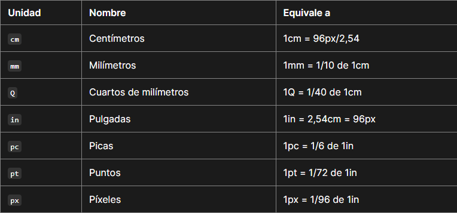
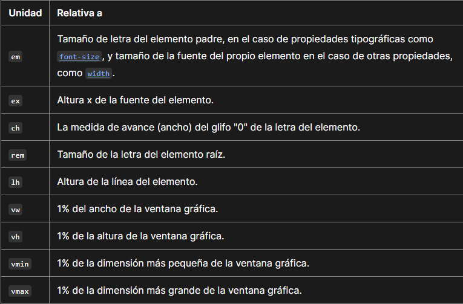
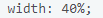
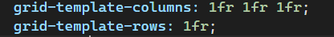
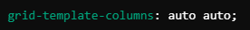

# Unidades de longitud que puede tener una estructura Grid

 

## Unidades de longitud absoluta   

---

## Unidades de longitud relativa   

 
---

## Porcentaje   

---

## Fracción de espacio disponible   
- Divide el espacio disponible en proporciones.  

   

Ejemplo: **``grid-template-columns: 200px 1fr 2fr``**;   

1. Espacio restante: Se divide en proporciones:
    - La segunda columna ocupará 1 parte del espacio restante.
    - La tercera columna ocupará 2 partes del espacio restante.

2. Si el contenedor tiene 1000px de ancho:
    - Espacio restante: 1000px - 200px = 800px
    - Segunda columna: (1 / 3) * 800px = 266.67px
    - Tercera columna: (2 / 3) * 800px = 533.33px   

---

## Automatico

- Se basa en el tamaño del contenido (contenido flexible).
- Si el contenido cambia de tamaño, la columna o fila también cambiará.
- No participa directamente en la división proporcional del espacio sobrante.

